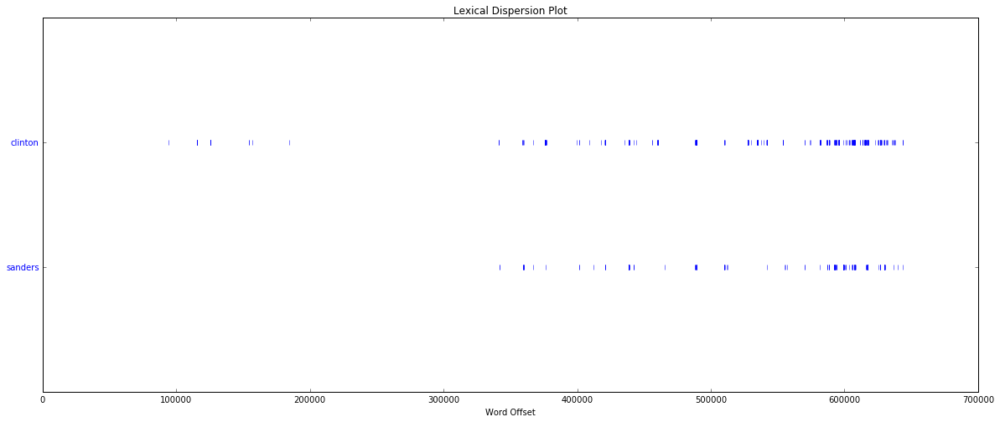
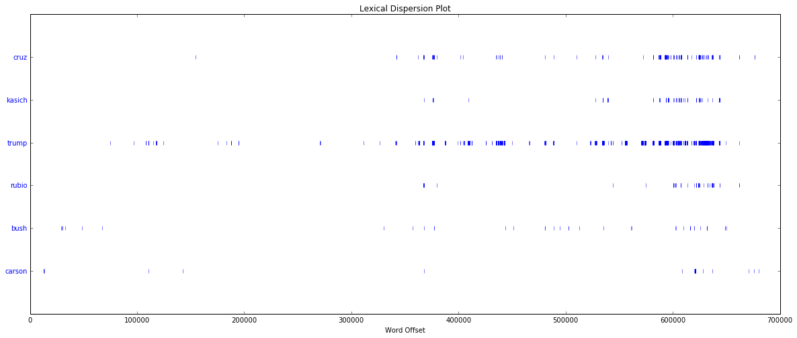
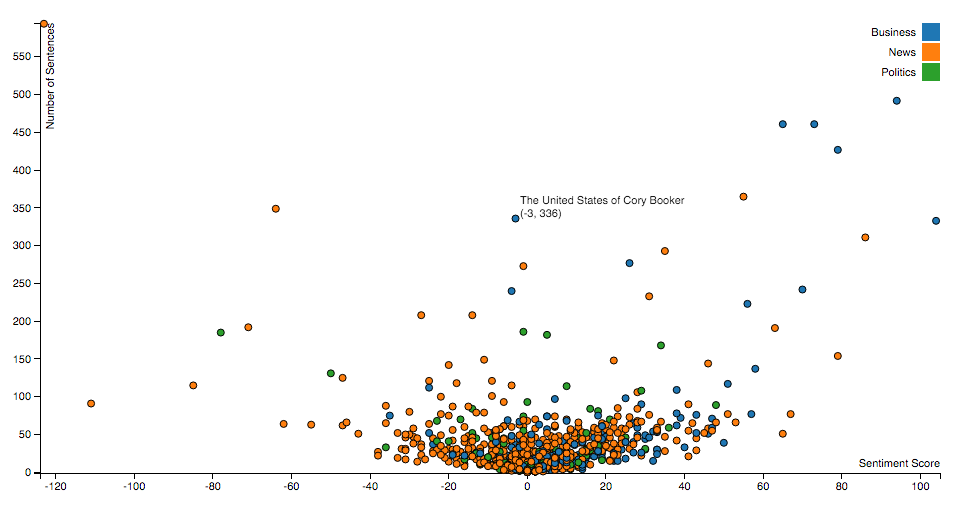

# Text Summarization  through Visualization

***

## Presentation 1 : 

10:00AM-11:30AM on April 23 via GoToWebinar

https://attendee.gotowebinar.com/register/8457348157408581635

***

## Introduction

Name: Team 1

Members: Lisa Combs, Olivia Chen, Prema Damodaran, Ryan Krog

***
##Summary

Every day, thousands of articles are published online about political candidates by news organizations, journalists, and bloggers. The abundance of political media poses an enormous challenge for candidates for political office and their campaigns. We propose a product, called PoliTrend, that helps campaigns and public officials track media coverage about a candidate and gauge the sentiment of this coverage. The product utilizes a massive ingestion feed called Baleen (a tool in the Python programming language) to capture thousands of articles published daily by professional and amateur writers: e.g. bloggers and news outlets. In itself, the centralization of thousands of news stories would be useful for campaigns, but PoliTrend provides further information about the sentiment of each article: does a news story present a candidate in a more positive or negative light? The central feature of the product is that it presents a visualization of trends (hence “trend” in the name) in the sentiment of political coverage over time. Media matters: how the media portrays a candidate can have important implications for that candidate’s ability to raise funds and his/her electoral prospects. Even small shifts in sentiment can swing an election. PoliTrend provides critical insights that campaigns can use to adjust their messaging strategies. The target audiences for this product are media outlets, interest groups and Political Action Committees (PACs), and the campaigns themselves.

## Goals

Our mentor, Benjamin Bengfort is currently finishing his PhD at the University of Maryland. He is working on a PyCon talk to be presented on May 30, 2016. Thus, our first major deadline will be to have a python-based data product ready to be incorporated into this talk. Though the text summarization will be conducted in python, our visualizations will be done in D3. Leading up to PyCon, we will focus on visualizations, and afterwards we will develop a web application.

The final product will be a gallery of data products visualizing:

1. Sentiment analysis
2. Map of geographical entities 
3. Topic models 
4. Word network map

Below is an example of a visualization in D3 we hope to create with our data.

***

## Data 

The dataset is a corpus of news and blog posts ingested using Baleen from  the period March 3, 2016, ongoing. The  latest dump we have received from Ben is from April 14, 2016. Currently, the data set contains 52k+  articles in HTML format for a size of approximately 3.6 GB. The corpus is  still growing at a rate of several thousand posts per day. We have converted the HTML files to txt files for NLP in python.

***

## Demo 

http://rkrog05.github.io/

Exploratory Analysis: MVP

https://github.com/DistrictDataLabs/04-team1/blob/master/MVP.ipynb

Lexical Dispersion Plot:

D3 Plot:

***

## Key Lessons

#### Adaptable code since we will be receiving new dumps.
        
1. HDP : We attended a MeetUp, where we saw a live topic model demostration, walking us through the steps from ingestion, how to learn from the data, and how to vizualize. Though LDA is often the preferred method for topic modelling, HDP has been extended to to allow for an unknown number of topics. 
2. Newspaper : We decided to use the Python package called "newspaper" to convert the html documents into text files so that they can be used to form a corpus that will be used for natural language processing. The input for newspaper is a url, which it uses to go the specific web page, download the html document, and parse the document into a readable text file. Therefore, the field of interest from the posts collection in the MongoDB database is the "url" field. We used mongoexport to download a sample of urls into a file that are subsequently used as inputs to the newspaper package.

***

## Next Steps

Between now and the next presentation on May 21, we will have:

- Refined our python code
- Created more visualizations!
- More summarization techniques
- Lexical complexity
- Suggestions?

***

## Questions?
